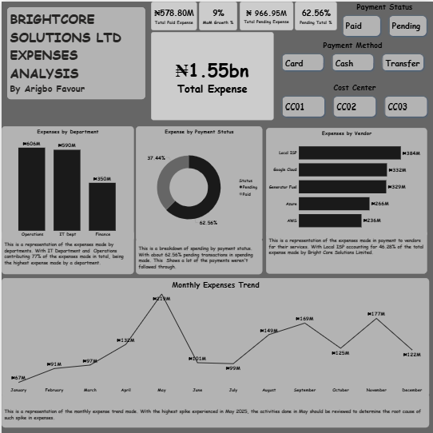

# Brightcore Solutions Ltd – Expense Analysis Dashboard

## Project Overview
This project analyzes the operational expenses of Brightcore Solutions Ltd to understand spending patterns, payment efficiency, vendor dependency, and departmental cost distribution.

The goal of the analysis is to provide management with insights into how company resources are being spent, identify areas of cost concentration, and highlight potential opportunities for financial optimization.

The analysis was performed using **Power BI**, where raw expense transaction data was transformed into an interactive dashboard for decision-making.

---

## Business Problem

Companies often struggle with tracking operational expenses across multiple departments, vendors, and payment channels.

This analysis addresses key financial questions such as:

- Which departments contribute most to company expenses?
- How much of the company’s expenses are still unpaid?
- Which vendors receive the highest payments?
- How do expenses fluctuate throughout the year?
- What cost centers are responsible for the largest share of spending?

---

## Business Questions Answered

1. What is the **total operational expense** incurred by Brightcore Solutions?
2. What percentage of expenses have been **paid vs pending**?
3. Which **department contributes the most to expenses**?
4. Which **vendors receive the highest payments**?
5. How do **monthly expenses trend throughout the year**?
6. Which **cost centers are responsible for the largest spending**?

---

## Dataset Description

The dataset represents expense transactions recorded by the company.

Key fields include:

- Transaction ID
- Department
- Vendor
- Payment Status (Paid / Pending)
- Payment Method (Cash / Card / Transfer)
- Cost Center
- Expense Amount
- Expense Date

---

## Data Preparation

The following steps were performed before analysis:

- Removed incomplete or inconsistent records
- Converted expense values into numeric format
- Standardized department and vendor naming
- Created calculated measures in Power BI for:
  - Total Expense
  - Paid Expense
  - Pending Expense
  - Monthly Expense Trend
  - Expense Growth %

---

## Key Metrics (KPIs)

The dashboard tracks the following KPIs:

- **Total Expense:** ₦1.55bn
- **Total Paid Expense:** ₦578.80M
- **Total Pending Expense:** ₦966.95M
- **Pending Expense Percentage:** 62.56%
- **Monthly Expense Growth:** 9%

---

## Dashboard Insights

### 1. Department Spending
Operations and IT departments account for **77% of total expenses**, indicating that these areas drive the majority of operational costs.

### 2. Payment Status
Approximately **62.56% of expenses are still pending**, which may indicate delayed payments or outstanding financial obligations.

### 3. Vendor Dependency
The company spends the most on **Local ISP, Google Cloud, and Generator Fuel**, highlighting reliance on technology infrastructure and operational utilities.

### 4. Expense Trend
Expenses peaked in **May**, suggesting either a major operational investment or seasonal activity.

Further investigation into May transactions may reveal the reason for the spike.

---

## Tools Used

- Power BI
- Excel
- DAX (Data Analysis Expressions)

---

## Business Impact

This dashboard enables management to:

- Monitor expense trends in real time
- Identify departments with high operational costs
- Track pending payments and manage financial obligations
- Evaluate vendor dependency and spending concentration

---

## Dashboard Preview

---
## Author

**Favour Arigbo**  
Data Analytics Portfolio Project
