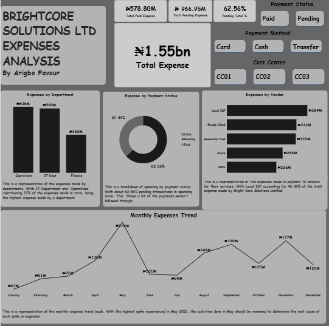

# NovaTech Retail Ltd – Sales Transaction Analysis

## Project Overview

This project analyzes retail sales transactions for NovaTech Retail Ltd to evaluate sales performance, profitability, discount strategies, and sales representative productivity.

The goal of the analysis is to help management understand revenue drivers, identify high-performing products, assess the impact of discounts on profitability, and monitor sales performance across different locations.

The analysis was conducted using **Power BI** to transform raw sales transaction data into an interactive dashboard.

---

## Business Problem

Retail companies must constantly monitor sales performance to maintain profitability and optimize their pricing strategies.

This analysis addresses key operational and strategic questions including:

- Which products generate the most profit?
- Which sales representatives drive the most revenue?
- How do discounts affect overall profitability?
- What are the monthly revenue trends?
- Which regions generate the highest sales?

---

## Business Questions Answered

1. What is the **total revenue generated** by NovaTech Retail?
2. What is the **total profit and overall profit margin**?
3. Which **products generate the highest profit**?
4. Which **sales representatives drive the most revenue**?
5. How do **discount levels affect profit**?
6. What is the **monthly revenue trend** across the year?
7. Which **locations contribute most to sales performance**?

---

## Dataset Description

The dataset contains retail sales transaction records including product details, pricing, discounts, and sales representative information.

Key columns include:

- Transaction ID
- Product Name
- Sales Representative
- City / Location
- Unit Sold
- Revenue
- Profit
- Discount
- Date of Sale
- Product Category

---

## Data Preparation

Data cleaning and transformation steps included:

- Removing incomplete records
- Standardizing product and sales representative names
- Formatting date fields for time-series analysis
- Creating calculated measures such as:
  - Total Revenue
  - Total Profit
  - Profit Margin %
  - Net Revenue
  - Average Discount

---

## Key Metrics (KPIs)

- **Total Revenue:** $953.36K
- **Total Profit:** $285.57K
- **Units Sold:** 1,466
- **Average Discount:** $5.61
- **Profit Margin:** 30%

---

## Dashboard Insights

### 1. Product Profitability
The **Monitor product line contributes approximately 25% of total profit**, making it the most profitable product category.

This indicates strong market demand for display hardware.

### 2. Sales Representative Performance
Sales rep **Kenny generates the highest net revenue**, contributing roughly **45% of total revenue**, indicating strong sales performance.

### 3. Discount Strategy
Sales rep **Tunde offers the highest average discount but produces the lowest revenue**, suggesting that excessive discounting may reduce profitability.

### 4. Revenue Trend
Revenue fluctuates throughout the year, with a **notable drop in August**.

This could indicate seasonal demand patterns or reduced sales activity.

### 5. Discount Impact on Profit
The analysis shows **diminishing returns on profit as discounts increase**, suggesting that maintaining lower discount levels may improve profitability.

---

## Tools Used

- Power BI
- Excel
- DAX

---

## Business Impact

This analysis helps NovaTech Retail:

- Identify top-performing products
- Evaluate the effectiveness of discount strategies
- Monitor sales team performance
- Track revenue trends over time
- Optimize pricing and sales strategies

---
## Dashboard Preview

---
## Author

**Favour Arigbo**  
Data Analytics Portfolio Project
